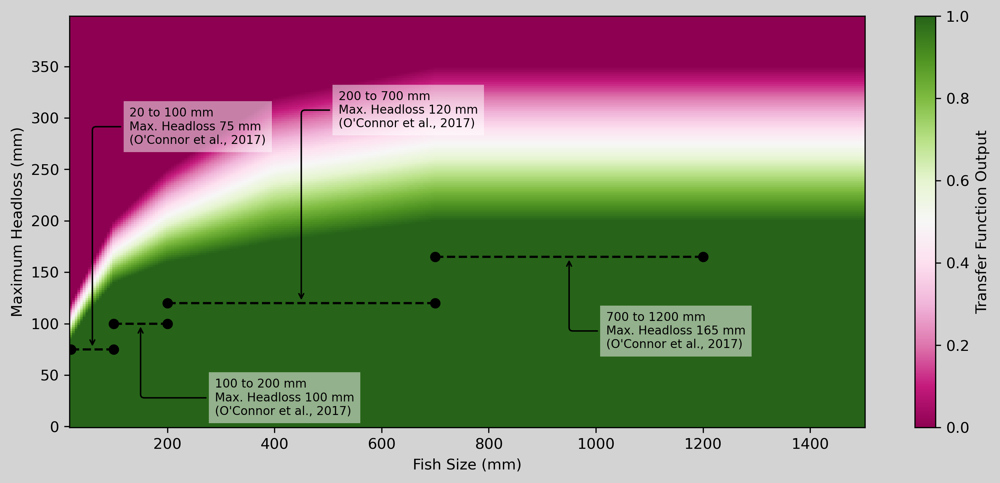
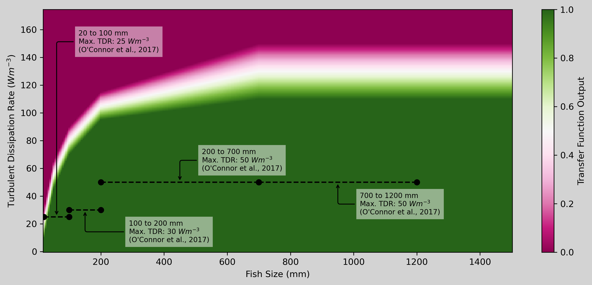
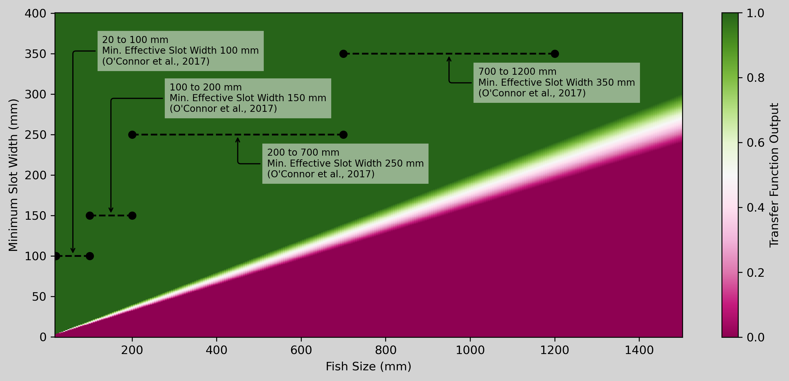
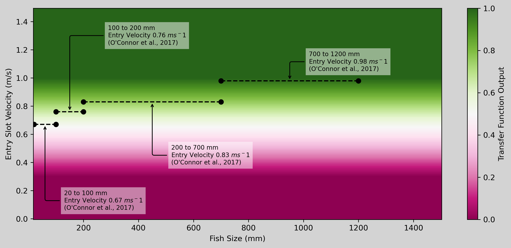

# vertical-slot-fishway-metric

A methodology and python tools for the estimation of vertical slot fishway function.

## The need for fishway performance tools

Vertical slot fishways operate by dividing the water level difference across a large barrier into a number of small steps. Fish ascend the fishway by moving from pool to pool, with water level differences between the pools generated by a flow construction, normally a vertically oriented slot.

The performance of a vertical slot fishway is highly dependent on its hydrodynamic performance. The hydrodynamic performance of vertical slot fishways is highly predictable using relatively simple numerical models. While the hydrodynamic performance is predictable the ability of vertical slot fishways to pass a given fish species and size is less predictable, at least using simple tools.

This methodology and tools is intended to provide an estimate of fishway function (for fish) that can be coupled to hydrodynamic models, in-situ obervations, or used in the design process.

Note that these tools have been prepared for use in Australia and has been calibrated for the fish species present in that bio-region. The swimming ability of fish in this region differs from those in other settings.

## A fishway performance metric

### Structure of the metric

Contemporary vertical slot fishway design criteria specify targets for the following hydrodynamic parameters:
- Maximum slot head loss (the maximum upstream to downstream water level difference between adjecent pools, normally measured in mm),
- Maximum Average Fishway Pool Turbulence (the maximum average pool turbulence anywhere in the fishway, normally measured in Watts per cubic meter)
- Slot width (the width of the slot, in mm)
- Minimum flow depth (the minimum water depth anywhere in the fishway, in m)
- Attraction flow intensity (measured at the fishway entry, and normally measured as slot loss at the entry in mm, or average slot velocity at the entry in meters per second).

These parameters have also been adopted as they key components in the fishway performance metric. While the inputs of the performance metric calculation mimic the makeup of most commonly used design criteria, the parameter values are not referenced directly. The reasoning for this is discussed below.

The fishway performance metric is calculated using the following equation.

- mVS is the main vertical slot performance metric value
- mS is the performance criteria sub-component relating to slot head losses
- mT is the performance criteria sub-component relating to pool turbulence
- min(mS, mT ) is combined effect of the hydrodynamic fishway sub components
- mD is the performance criteria sub-component relating to fishway depth
- mW is the performance criteria sub-component relating to fishway width
- min(mS, mT ) is combined effect of the fishway sizing components
- mA is the performance criteria sub-component relating fishway attraction

### Sub-components and Transfer Functions

The value of each of the fishway metric sub-components is a number between zero annd one. Each sub-metric is calclated using a transfer function that converts two inputs into a single output. One input to the transfer function is always fish size, in mm. The other input is specific to the sub-metric:
- for mS the input is maximum fishway slot head loss in mm
- for mT the input is maximum average pool turbulence in W m-3
- for mD the input is minimum fishway depth in m
- for mW the input is minimum effective slot width in mm
- for mA the input is slot-averaged entry velocity in ms-1

The operation of the transfer funcitons is intended to be flexible and can be any system where an output is calculated from the specified inputs is acceptable. The current transfer functions employ a simple interpolation scheme where for each transfer function a matrix of values are specified including:
- fish size, for example [20 mm, 50 mm, 100 mm]
- parameter value for _full function_ for example [50 mm, 60 mm, 70 mm]
- parameter value for _no function_ for example [100 mm, 120 mm, 150 mm]

The transfer function are calculated by:
- using the specified input fish size to calculate a size specific interpolated _full function_ and _no function_ value
- using the specified parameter input to calculate a transfer function value, interpolating between the previosuly calculated _full function_ and _no function_ values

The transfer functions are essentially a two-dimensional look up table, and the five in use for this project are presented below.

### Derivation of the transfer functions

The methodology used to derive the five individual transfer functions varies. The transfer functions relating to fishway size (slot width and depth) are based on dimensional reasoning and some information correlating fish width and length, for key species. The depth transfer function has been informed by PIT-tag observations of fish ascending fishways operating at low depth.

The hydrodynamic transfer functions (slot loss and turbulence) have been calibrated against the result of:
- 16 published vertical slot fishway evaluations, based on entry and exit trapping,
- A long-term analysis of PIT-tag ascent records against hind-cast fishway hydraulic conditions for 5 fishway structures,
- Several unpublished observations of fishway ascent performance, included as represent conditions no normally observed during fishway operation.

A more detailed description of the tranfer function calibration process will be added to this documentation in the next model revision.